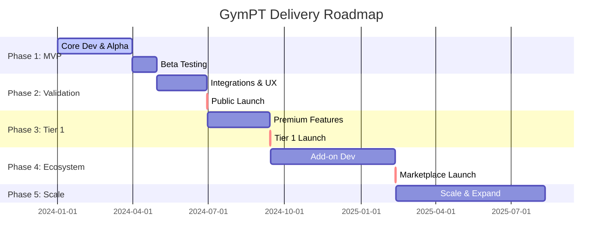

# GymPT High-Level Delivery Plan

## Executive Summary

GymPT is an AI-powered training companion designed to democratize personal training. This delivery plan outlines a phased approach to bootstrapping the startup, moving from a solid MVP foundation to a rich, monetized ecosystem, focusing on rapid value delivery, iterative feedback, and scalable architecture to achieve product-market fit before expanding.

## Phase 1: MVP Foundation

**Timeline:** 3-4 months
**Goal:** Launch a functional MVP that delivers core value to early adopters.
**Pricing Model:** **Free Tier** (User Acquisition & Validation)

### Key Deliverables & Milestones

- **M1.1: User Authentication & Profile System:** Google Sign-in (Supabase), basic profile (goals, equipment, injuries).
- **M1.2: Training Plan Generation:** AI-generated multi-week plans.
- **M1.3: Training Session Management:** AI-generated daily sessions, step-by-step runner, logging (Reps, Weight, RPE), rest timer.
- **M1.4: Basic Analytics Dashboard:** Session summary, weekly consistency.
- **M1.5: Beta Launch:** Internal and waitlist beta before public.

## Phase 2: Market Validation & Integration

**Timeline:** 2-3 months
**Goal:** Validate product-market fit and expand ecosystem compatibility.
**Pricing Model:** **Free Tier** (Growth Focus)

### Key Deliverables & Milestones

- **M2.1: Fitness Platform Integrations:** Google Fit / Apple Health sync (read/write).
- **M2.2: User Experience Refinement:** Based on beta feedback.
- **M2.3: Public Launch:** Wider release.

## Phase 3: Premium Tier (Tier 1) Launch

**Timeline:** 2-3 months
**Goal:** Monetize through intelligent premium features that enhance training effectiveness.
**Pricing Model:** **Tier 1 Subscription**

### Key Deliverables & Milestones

- **M3.1: Advanced Analytics Engine:** Progress trends, muscle heatmaps.
- **M3.2: Training Intelligence Features:** "Why this exercise?", recovery insights, enhanced AI adaptation.
- **M3.3: Subscription System & Monetization:** Paywall (Stripe/RevenueCat).

## Phase 4: Add-on Ecosystem Development

**Timeline:** 4-6 months
**Goal:** Create differentiated premium experiences and establish a platform for third-party extensions.
**Pricing Model:** **Add-on Purchases / Higher Tier**

### Key Deliverables & Milestones

- **M4.1: Real-Time Video Call Trainer:** AI rep counting/form check (WebRTC/TF.js).
- **M4.2: Generative Music Player:** AI workout soundtracks.
- **M4.3: Customizable AI Trainers:** Persona-based coaching.
- **M4.4: Add-on Marketplace Infrastructure:** For add-ons and digital assets.

## Phase 5: Scale & Ecosystem Growth

**Timeline:** Ongoing
**Goal:** Scale user base, expand marketplace, and establish GymPT as a platform.
**Pricing Model:** Existing + Marketplace Revenue

### Key Deliverables & Milestones

- **M5.1: Marketplace Expansion:** More third-party content.
- **M5.2: International Expansion:** Localization.
- **M5.3: Advanced Platform Features:** Offline-first, wearables.

---

## Key Success Metrics by Phase

| Phase   | User Target    | Revenue Target    | Retention   |
| :------ | :------------- | :---------------- | :---------- |
| Phase 1 | 100 beta users | $0 (validation)   | 40%+ weekly |
| Phase 2 | 1,000+ users   | $0 (growth focus) | 50%+ weekly |
| Phase 3 | 5,000+ users   | $5-10K MRR        | 60%+ weekly |
| Phase 4 | 20,000+ users  | $30-50K MRR       | 65%+ weekly |
| Phase 5 | 100,000+ users | $200K+ MRR        | 70%+ weekly |

---

## Critical Dependencies & Risks

**Technical Risks:**

- Real-time video analysis complexity (Phase 4)
- AI model accuracy and reliability
- Infrastructure scaling costs

**Market Risks:**

- Competitive landscape
- User acquisition costs
- Premium feature conversion rates

**Mitigation Strategies:**

- Start simple with MVP to validate core value
- Build strong free tier for organic growth
- Iterative development based on user feedback
- Lean operations until revenue validation

---

## Visual Roadmap

## Technical Considerations

- **Frontend:** Nuxt 4 (Vue 3) + Element Plus.
- **Backend:** Supabase (Auth, DB, Realtime).
- **AI:** Cloudflare Workers AI (Llama/OpenAI compatible).
- **Payments:** Stripe or RevenueCat integration (Phase 3).
- **Media:** WebRTC and Web Audio API (Phase 4).
